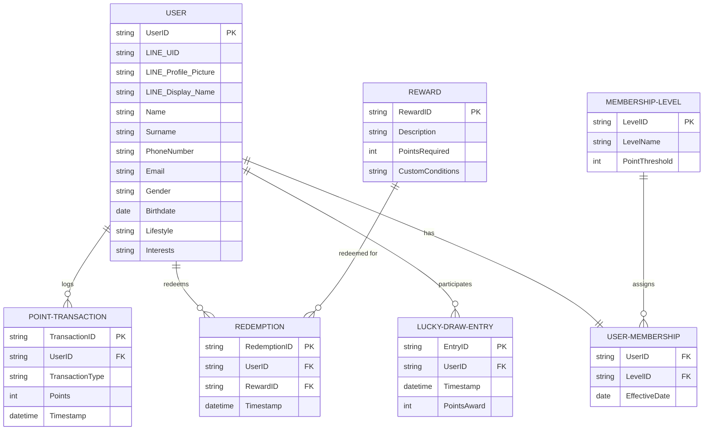

```mermaid
erDiagram
USER ||--o{ POINT-TRANSACTION : logs
USER ||--o{ REDEMPTION : redeems
USER ||--o{ LUCKY-DRAW-ENTRY : participates
USER ||--|| USER-MEMBERSHIP : "has"
REWARD ||--o{ REDEMPTION : "redeemed for"
MEMBERSHIP-LEVEL ||--o{ USER-MEMBERSHIP : "assigns"

    USER {
        string UserID PK
        string LINE_UID
        string LINE_Profile_Picture
        string LINE_Display_Name
        string Name
        string Surname
        string PhoneNumber
        string Email
        string Gender
        date Birthdate
        string Lifestyle
        string Interests
    }

    POINT-TRANSACTION {
        string TransactionID PK
        string UserID FK
        string TransactionType
        int Points
        datetime Timestamp
    }

    REWARD {
        string RewardID PK
        string Description
        int PointsRequired
        string CustomConditions
    }

    REDEMPTION {
        string RedemptionID PK
        string UserID FK
        string RewardID FK
        datetime Timestamp
    }

    MEMBERSHIP-LEVEL {
        string LevelID PK
        string LevelName
        int PointThreshold
    }

    USER-MEMBERSHIP {
        string UserID FK
        string LevelID FK
        date EffectiveDate
    }

    LUCKY-DRAW-ENTRY {
        string EntryID PK
        string UserID FK
        datetime Timestamp
        int PointsAward
    }
```