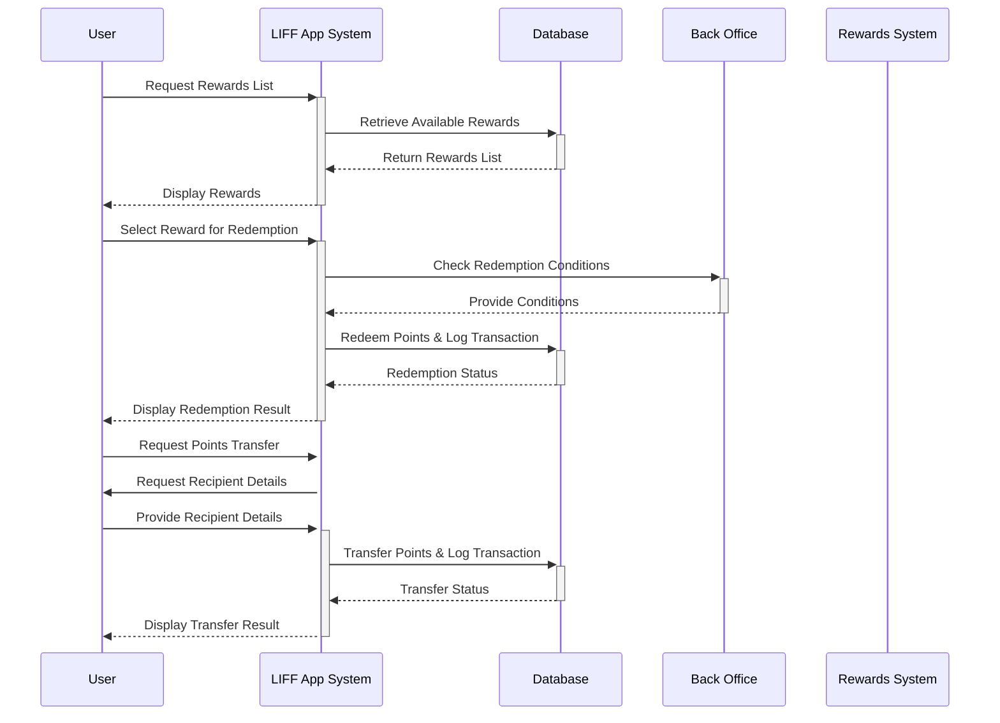

2.1.1 Registration Page

2.1.2 Collect Point Page

2.1.3 Point History Page

2.1.4 Redemption Page
-**เพิ่ม ระบบส่ง points ให้กับผู้ใช้งาน line application ท่านอื่น เเละเก็บประวัติการส่งไว้ใน History Redemption System**

2.1.5 History Redemption

2.1.6 Lucky Draw
-เพิ่มระบบการเช็คอิน เช็คอินครบทุก 7 วัน จะได้รับ point พิเศษ เพื่อเพิ่มการ engagement ให้มากขึ้น

2.1.7 Questionnaire

2.1.8 Membership Levels (new function)
เเบ่งระดับของสมาชิกตาม point สะสมทั้งหมดโดยดึงข้อมูลจาก database ในเเต่ละระดับจะมีสิทธิ์พิเศษในการใช้ point เเตกต่างกันไป โดยเเบ่งออกเป็น 3 ระดับ

1.1.Gold Level : ระดับสูงสุด สามารถเเลก Exclusive rewards รวมถึง Special deals เเละมี Priority support
1.2.Silver Level : ระดับกลาง สามารถเเลก Special deals  
1.3.Bronze Level : ระดับเริ่มต้น สามารถเเลก standard deals ได้

